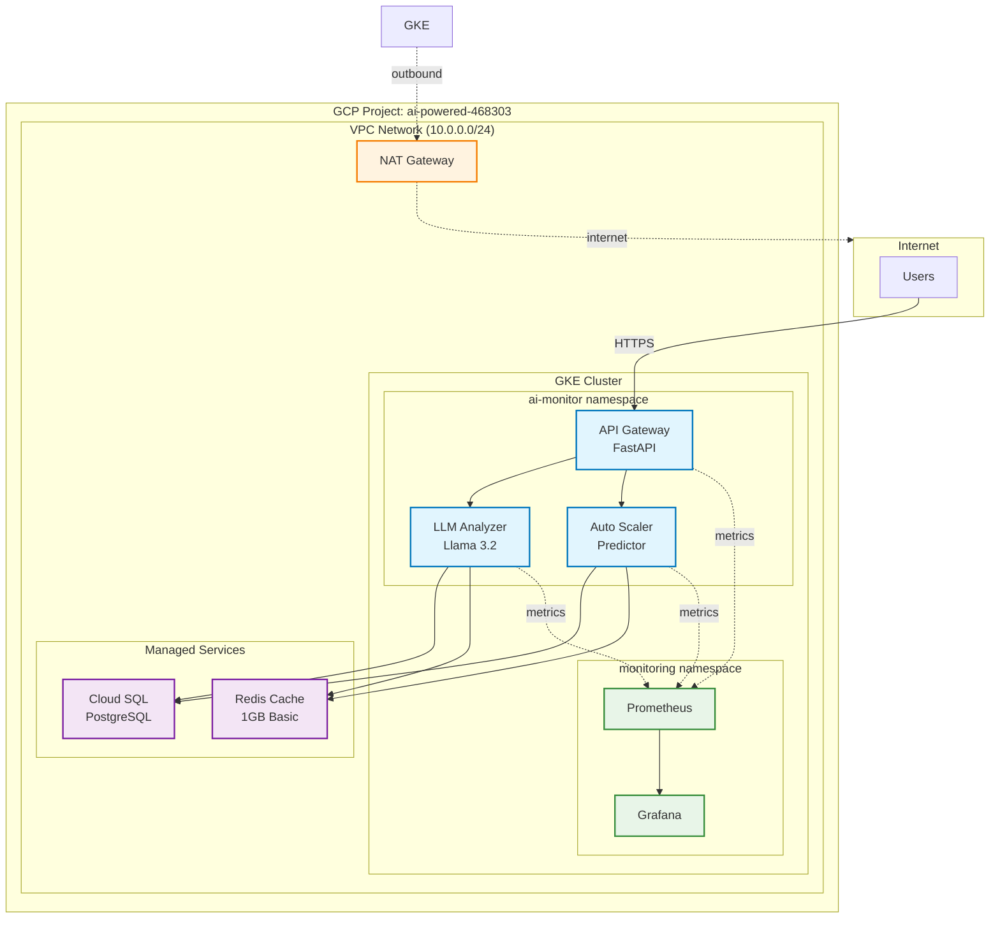
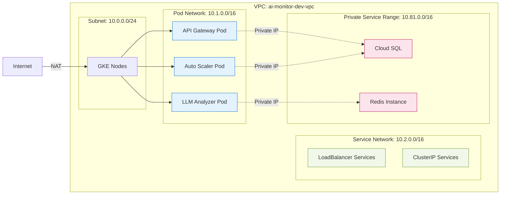
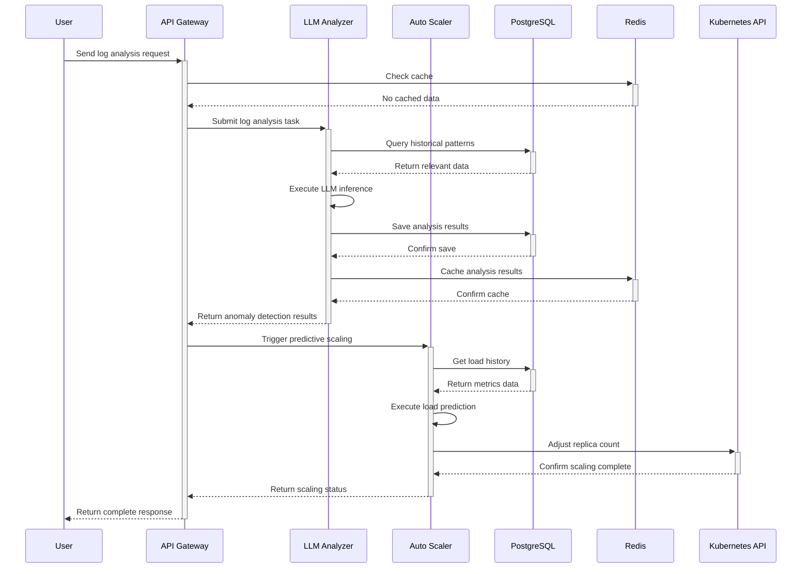
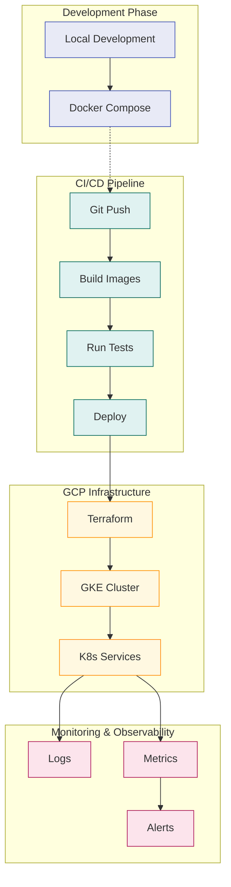
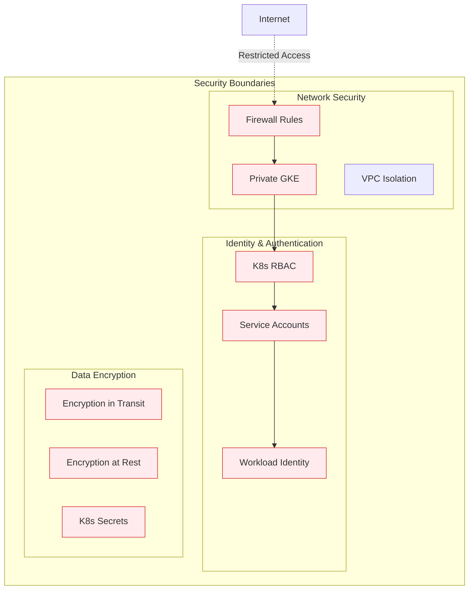

# AI Service Monitor - Architecture Design

## System Architecture Overview

## Network Architecture Details

## Data Flow Diagram

## Deployment Architecture

## Cost Structure

| Component | Specification | Monthly Cost (USD) |
|-----------|---------------|-------------------|
| **GKE Management Fee** | Regional cluster | $74.40 |
| **Compute Nodes** | 2x e2-medium (preemptible) | ~$24 |
| **Cloud SQL** | db-f1-micro | ~$9 |
| **Redis** | 1GB Basic | ~$25 |
| **Network** | NAT Gateway + traffic | ~$10 |
| **Storage** | Persistent Disk | ~$5 |
| **Total** | | **~$147/month** |

## Security Architecture

## Scalability Design

### Horizontal Scaling
- **Pod Auto Scaling**: HPA based on CPU/Memory utilization
- **Node Auto Scaling**: Cluster Autoscaler automatically adjusts node count
- **Database**: Cloud SQL supports read replicas

### Vertical Scaling
- **Resource Adjustment**: Dynamic Pod resource limit adjustment
- **Node Upgrades**: Rolling updates to larger instance types
- **Service Tier**: Redis can upgrade to Standard HA

### Regional Expansion
- **Multi-zone Deployment**: Regional GKE spans multiple zones
- **Disaster Recovery**: Cross-region backup and recovery
- **Load Distribution**: Global Load Balancer support

## Maintenance & Monitoring

### Automated Maintenance
- **GKE Version Updates**: Automatic Kubernetes version upgrades
- **Node Maintenance**: Automatic node repair and restart
- **Backup Strategy**: Daily automated database backups

### Monitoring Metrics
- **Application Metrics**: API response time, error rates
- **Infrastructure Metrics**: CPU, memory, network utilization
- **Business Metrics**: LLM inference latency, scaling decision accuracy

### Alert Strategy
- **Real-time Alerts**: Service downtime, high error rates
- **Trend Alerts**: Sustained resource usage increase
- **Predictive Alerts**: ML-based anomaly detection